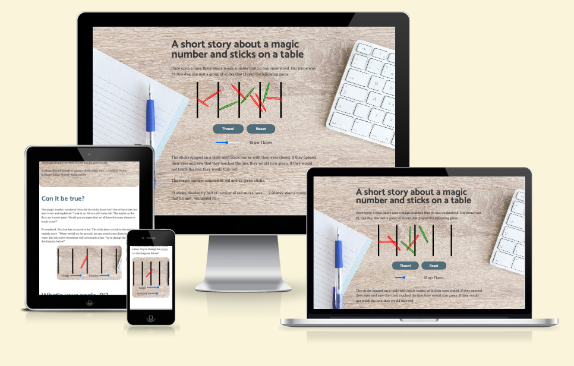

# A short story about a magic number and throwing sticks 

The number $\pi$ is widely used in probably each and every modern technological device. Yet, its understanding is somehow limited - like a car, we can use it without knowing exactly what it does. This website is an attempt to teach the value of this number in an interactive and fun way.

Link to the live page : [Link to live Website]( https://nils-n.github.io/throwing-sticks/)

<p align="center">

</p>


## Table of Contents

----- 

## User Experience (UX)

### User Stories 

As a first-time user...
<ol>
    <li> I want a to learn about &pi; by exploring data interactively so that my learning experience is fun.</li>
    <li> I have never heard about &pi; and i am curious to learn what makes this number special. </li>
    <li> I am aware of the value of &pi;  but i never liked the dull, academic style how it is taught on other websites. Visiting this website, i want to refresh my memory in a fun way what this number was all about. </li>
    <li> I want a friendly, entertaining website so that i can show it to my friends or children and motivate them to learn more about math. </li>
</ol>

### Website Aims

<ul>
    <li> Motive a change to the dull academic-style websites by using modern web technologies </li>
    <li> Advertise the value of &pi; in a fun, interactive and exploratory way </li>
    <li> Promote the art of coding by showcasing modern browser technologies </li>
    <li> Provide accurate and correct information </li>
</ul>

### How these needs are addressed

- All possible user scenarios and potential needs were identified and documented. 
- The user needs to feel instantly a positive emotion and should know instantly what to expect from this website. 
- THIS IS A WIP 

### Opportunities 

| Description                            | Impact | Feasibility | 
|----------------------------------------|--------|-------------|
| Promote Math and the value of &pi;     | 5      | 5           | 
| Entertain the users                    | 5      | 5           | 
| Animate the calulation of Pi using thrown sticks in JS  | 5      | 5           | 
| Animate the explanations using JS      | 5      | 5          | 
| Implement JS Simulation with a TDD approach        | 4      | 3          | 
| ~~Implement JS Front-End Display with a TDD approach~~   | 4      |   1         | 
| ~~Do large-scale simulation (> 10e6 sticks)~~  | 2   | 1    | 
| **Sum**                          | **20**   | **20**     | 

### Feature selection

- The sum of Impact/Feasibility is balanced after discarding the entry "Do large-scale simulation (> 10e6 sticks)".
-  This had to be discarded because it is currently not feasible without using dedicated simulation software (i.e. [Processing](https://processing.org/)) or running the simulation on a backend server - which is beyond the scope of this project. 
- I figured that for educational purposes, an animation of ~1000 sticks the simulation can be handled by most browsers using d3.js and would still lead to a sufficient approximation of &pi; .
- It was consciously chosen to develop the Javascript using a `test-driven development` (TDD) approach. While it was not strictly necessary to do this, in my opinion this approach enforced clean coding, small functions, and less likelihood for errors - which greatly enhanced readibility and maintainability of the code. It came with a small risk since i just started programming with Javascript, but in retrospective it turned out extremly valuable. 
- During the implementation, I have come to realize that implementing a `test-driven` approach for front-end display of the simulation is better suited within a framework such as `React`.  The history of the struggle with `d3` unit test using `jest` was documented in [ this section](./SETUP.md).
 I left this up for future extension as this would be beyond the current scope of the project. As consequence, unit testing of all front-end elements using `d3.js` was reduced to checking correct inputs (and not the actual rendering inside the DOM). 


----- 

## Design

### Color Scheme

### Typography

### Imagery 

### Wireframes

----- 

## Features

### General Features 

### Main Page 

#### 404 Page 

----- 

### Future Implementations

- Estimate $\pi$ using similar heuristical methods ( see example  [here](https://academo.org/demos/estimating-pi-monte-carlo/) )
- compare these estimates using interactive charts (i.e. for efficiency, run-time, stability)
- visualize  how to derive $\pi$ in a graphical or algebraic way 
- visualize other intersting numbers such as $\phi$ (golden ratio), or the  Euler number, or $\tau$ 

### Accessibility

## Technologies Used 

- GitPod as IDE [Link](https://www.gitpod.io/)
- Git / GitHub  for Version Control [Link] (https://github.com/)
- Figma for Wireframs [Link](https://www.figma.com/)
- Mac OS Image Preview Tool for cropping and resizing Images 
- Favicon for making a browser Icon [Link](https://favicon.io/favicon-converter/)
- W3 Validation Tools for Testing [Link](https://validator.w3.org/)
- Shields.io for adding badges this Readme file [Link](https://shields.io/)
- [Markdown Beautifier](https://markdownbeautifier.com/#)  to format tables in Readme

### Languages Used

- HTML 
- CSS 
- Javascript

### Frameworks Used
- N/A

----- 

## Deployment and Local Development 

### Deployment 

This website was deployed via GitHub Pages using the main branch: [Link to live Website]( https://nils-n.github.io/throwing-sticks/). The following steps were followed: 

- Log into GitHub and navigate to this repository  
- Click on "Settings" Button 
- Click on "Pages" button 
- Select "main" brach as Source and click on "Save". After a few minutes, the website should be live. 

### Local Development

#### How to Fork

- Log into GitHub and navigate to this repository  
- Click on the "Main" Branch button and type the name of the forked branch
- Click on "Create Branch" to confirm

#### How to Clone

- Click on the "Code" button and copy the link to this repository
- open terminal on your machine and navigate to the folder you want to store a local copy
- in the terminal, type 'git clone ' followed by the link you copied
- press enter to confirm


--- 

## Testing 

### Testing Procedure 
The website was tested extensively for several apsects , and the results were documented in [TESTING.md](./TESTING.md) 

- Functionality
- User Stories
- Usability and Accessibility 
- Compatibility and Responsiveness 

Also, this website was developed using a `test-driven development` (TDD) approach using the `JEST` framework for javascript. Results of of the unit tests are documented in same document above. The reasons for TDD is to 
- ... ensure core functionality
- ... better code re-usability 
- ... better code readibility by enforcing smaller functions.

(clean code principles).


---
### Solved Bugs 

- There is a a separate document in this repository that describes in more details :  [SETUP.md](./SETUP.md) 
    - This  [SETUP.md](./SETUP.md)  document describes the majority of bugs encountered during the setup of of this project.
    - it also documents the successful and unsuccessful solution approaches, and provides a justification for the final resolution strategy that was eventually applied to this project.  
    - the majority of the bugs occured while trying to setup an javascript environment that can be tested with a unit testing framework such as `Jest`, works in the browser (conflict between `commonJS` and `ES` modules), and poses no security risk from using external libaries such as `d3.js`
- There was a bug of a wrongly designed test that created false positive test result. The test was for randomness of the orientation of new stick. It was designed to assert that an array of `100` sticks had unique orientations. This approach was inspired by a hint from [Stackoverflow](https://stackoverflow.com/questions/57001262/jest-expect-only-unique-elements-in-an-array)
  to test that the `Array` length equals the lenght of the array converted to a `Set` (if there was a duplicate, the `size of Set <  Array Length`)). However, in my implementation of the `for` loop i switched the the second and third entry, which casuses the loop to run exaclty `1 times` - with the consequence that `Array Length` is always equal to `Set Size`!
    - The solution was to correct the order of loop header in the `simulation.test.js`, and now the test failed as expected. 
- For debugging, i wanted to test the Simulation classes also in the browser. However, `main.js` could not be loaded in the browser and fails with a `ReferenceError: module is not defined`. A hint to the solution was found in this article  [How To Fix ReferenceError require is not defined in JavaScript](https://isotropic.co/how-to-fix-referenceerror-require-is-not-defined-in-javascript/) that suggests to use `browserify`:
    -  Following the docmentation of [browserify](https://browserify.org/), the problem is fixed by bundling into a `bundle.js` and then importing this bundled file as `<script>` into the `index.html` :
        ```bash
        npm install -g browserify
        npm install uniq
        browserify main.js -o bundle.js
        ```
- This bundling works for individual files with files that use `require` - but it failed with same `Reference error - require not defined` with scripts that have  nested imports such as the `Simulation` class from `simulation.js`. The solution was to check out a solution in this README from a previous bugfix (as described in [SETUP.md](./SETUP.md)) to use `webpack` instead to create a compiled version of the vanilla javascript file. The small downside is, now we have to manually compile the javascript files before using them in the browser - but this is acceptable since it does not affect the final website, only the development workflow.
    ```
        bash
        npm run build
    ```
- Functions related to drawing the `d3.js` outputs of the simulation such as`drawEmptyDisplay` or `drawMidlines` would either draw at wrong locations or log errors such as `Error: <svg> attribute width: Expected length, "NaN".` This was caused when calling it with a previous version of this function that would occasionaly use different global parameter such as `width` or `height` that would be overwritten at various points in the code. The soltuion was to refactor the code into a `DisplayConfiguration` class that handles the sizing and positioning of the elements on the screen (without actually drawing them). In this way, the `TDD` approach of implementing functions that use `d3.js` was still at least partially achieved.
- During Manual Testing using the WebAIM Accessibility Checker, it turned out that the sliders did not have associated `aria` labels, which would make this website impossible to interact for users with visual impairments. Adding the apropriate `aria-labels`, the validation passes. 


### open Bugs 

- There is a bug that the width of the `SVG` would not match the size of the parent division. 
- From a user perspective, this simulation seems odd because the sticks would only jump between the first two lines

---- 

## Credits 

### Code Used

- Github badges from [Shields.io](https://shields.io/)
- Excel Template for Website Testing [Link to Page](https://www.guru99.com/download-sample-test-case-template-with-explanation-of-important-fields.html)
- Animations based on tutorials 
    - for getting start with  D3.js library : [d3-graph-gallery](https://d3-graph-gallery.com/intro_d3js.html)
    - using transitions in D3 : [d3-graph-gallery](https://d3-graph-gallery.com/graph/interactivity_transition.html)
- Unit Testing based on `Simon game` example of the Code Institute Course Material (`Javascript Testing with Jest`), especially how to check DOM changes and how to test for events
- D3.js Tutorial about general D3.Js aspects including Translation and Rotation of Elements : [Link](https://www.tutorialspoint.com/d3js/d3js_svg_transformation.htm) 
- General Tutorial for d3.js : [Link](https://d3-graph-gallery.com/intro_d3js.html)
- To improve Google Lighthouse Performance : [The optimal way to load fonts - CSS Tricks](https://css-tricks.com/how-to-load-fonts-in-a-way-that-fights-fout-and-makes-lighthouse-happy/)

### Content 

- All of the content was written by myself.
- Externally used code (such as code snippets from stackoverflow) in this project are referenced in this Readme and inside the Html/Css/Js source code. 


## Acknowledgements
- Teaching and Support from Code Insitute [Code Insitute](https://codeinstitute.net/)
    - Lesson "JavaScript Testing with Jest" and the testing approach of its "Simon" codealong Challenge
- Example Readme from Kera Cudmore [Kera's Github](https://github.com/kera-cudmore/readme-examples/blob/main/milestone1-readme.md)
- Color Palette Generator from [Mycolor.space](https://mycolor.space/)
- Font Generator from  [Fontjoy](https://fontjoy.com/)
- Fonts from [Google Fonts](https://fonts.google.com/) 
- Images from  [Pexels](https://pexels.com/) : 
    - add refernce HERE once decided on final images 
- Kevin Powell's [Youtube](https://www.youtube.com/@KevinPowell) Channel: 
    - How to approach a design layout with Figma [Youtube Link](https://youtu.be/KYFwcIRx16g)
    - 6 simple typography tips to more professional looking sites [Link](https://youtu.be/6ardZEhjvV0)
    - Give your site a fantastic color scheme fast [Youtube Link](https://youtu.be/mq8LYj6kRyE)
    - Concepts to help simplify CSS layouts [Youtube Link](https://youtu.be/nYyFf-97Qqg) 
    - Build a responsive website with HTML & CSS   [Part1 ](https://youtu.be/h3bTwCqX4ns), [Part 2](https://youtu.be/3K6zr1CdZy8), [Part 3](https://youtu.be/Ch_LoWKLv3A)
    - The secret to mastering CSS layouts [Youtube Link](https://youtu.be/vHuSz4fRM88)
    - 5 CSS mistakes that I see way too often [Youtube](https://youtu.be/iHEkRIF7zxI)
    - From Design to Code - HTML & CSS from scratch [Youtube](https://www.youtube.com/watch?v=KqFAs5d3Yl8)
- Useful articles how to approach unit testing of d3 and TDD :
    - Tips for Unit Testing D3 [Link](https://eng.wealthfront.com/2016/07/27/tips-for-unit-testing-d3/)
    - Testing D3.js With Jasmine [Link](https://busypeoples.github.io/post/testing-d3-with-jasmine/)
    - Leveling Up D3: Test Driven Development [Link](https://www.eventbrite.com/engineering/leveling-up-d3-test-driven-development/)
- A great tutorial on using with Jest while maintaining browser compatibility. This was the only source that explained in great detail how to use webpack. These advices in these talks solved many of the conflicts between ES6 and commonJS in this project.
    - [15. Install Jest Testing Framework with npm for ES6 module support - JavaScript Testing](https://youtu.be/ZnIv8u2-XrA)
    - [18. Babel Loader Setup in the Webpack 4 Configuration file for compiling Code - Part 1](https://youtu.be/vGZoGwBC7js) 
    - [19. Babel Loader Setup in the Webpack 4 Configuration file for compiling Code - Part 2 ](https://youtu.be/vGZoGwBC7js) 
- Scrimba Courses and Tutorials for a better understanding: [Scrimba Page](https://scrimba.com/)
    -  Learn Javascript (Per Harald Borgen)
    -  Introduction to Unit Testing (Dylan Israel) 
    -  Introduction to Clean Code (Dylan Israel) 
    -  Introduction to D3 (Sohaib Nehal) 
- Very eye-opening talks from Dylan Israel : [Link - Clean Coding](https://youtu.be/YQsU2Zq2Zis) 
- Thanks to my mentor Ronan (Code Institute) for his advices and clear feedback 


