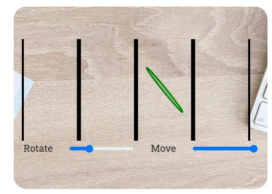

# A short story about a magic number and throwing sticks 

The number $\pi$ is widely used in probably each and every modern technological device. Yet, its understanding is somehow limited - like a car, we can use it without knowing exactly what it does. This website is an attempt to teach the value of this number in an interactive and fun way.

Link to the live page : [Link to live Website]( https://nils-n.github.io/throwing-sticks/)

<p align="center">

</p>


## Table of Contents

----- 

## User Experience (UX)

### User Stories 

As a first-time user...
<ol>
    <li> I want a to learn about &pi; by exploring data interactively so that my learning experience is fun.</li>
    <li> I have never heard about &pi; and i am curious to learn what makes this number special. </li>
    <li> I am aware of the value of &pi;  but i never liked the dull, academic style how it is taught on other websites. Visiting this website, i want to refresh my memory in a fun way what this number was all about. </li>
    <li> I want a friendly, entertaining website so that i can show it to my friends or children and motivate them to learn more about math. </li>
</ol>

### Website Aims

<ul>
    <li> Motive a change to the dull academic-style websites by using modern web technologies </li>
    <li> Advertise the value of &pi; in a fun, interactive and exploratory way </li>
    <li> Promote the art of coding by showcasing modern browser technologies </li>
    <li> Provide accurate and correct information </li>
</ul>

### How these needs are addressed

- All possible user scenarios and potential needs were identified and documented. 
- The user needs to feel instantly a positive emotion and should know instantly what to expect from this website. 
- THIS IS A WIP 

### Opportunities 

| Description                            | Impact | Feasibility | 
|----------------------------------------|--------|-------------|
| Promote Math and the value of &pi;     | 5      | 5           | 
| Entertain the users                    | 5      | 5           | 
| Animate the calulation of Pi using thrown sticks in JS  | 5      | 5           | 
| Animate the explanations using JS      | 5      | 5          | 
| Implement JS Simulation with a TDD approach        | 4      | 3          | 
| ~~Implement JS Front-End Display with a TDD approach~~   | 4      |   1         | 
| ~~Do large-scale simulation (> 10e6 sticks)~~  | 2   | 1    | 
| **Sum**                          | **20**   | **20**     | 

### Feature selection

- The sum of Impact/Feasibility is balanced after discarding the entry "Do large-scale simulation (> 10e6 sticks)".
-  This had to be discarded because it is currently not feasible without using dedicated simulation software (i.e. [Processing](https://processing.org/)) or running the simulation on a backend server - which is beyond the scope of this project. 
- I figured that for educational purposes, an animation of ~1000 sticks the simulation can be handled by most browsers using d3.js and would still lead to a sufficient approximation of &pi; .
- It was consciously chosen to develop the Javascript using a `test-driven development` (TDD) approach. While it was not strictly necessary to do this, in my opinion this approach enforced clean coding, small functions, and less likelihood for errors - which greatly enhanced readibility and maintainability of the code. It came with a small risk since i just started programming with Javascript, but in retrospective it turned out extremly valuable. 
- During the implementation, I have come to realize that implementing a `test-driven` approach for front-end display of the simulation is better suited within a framework such as `React`.  The history of the struggle with `d3` unit test using `jest` was documented in [ this section](./SETUP.md).
 I left this up for future extension as this would be beyond the current scope of the project. As consequence, unit testing of all front-end elements using `d3.js` was reduced to checking correct inputs (and not the actual rendering inside the DOM). 


----- 

## Design

### Color Scheme
A neutral colour tone was selected to create an inviting, positive atmosphere. Three colors were chosen as sufficient to be used on the website. The reason for the small number of colors was to not overload the user with visual information and keep distractions to a minimum:

- White was chosen as Background 
- Dark Gray was chosen instead of black as it looked less aggressive and did not fit the playful intention of the website 
- Blue Green was chosen by using the [Color Palette Generator](https://mycolor.space/). As input, the wooden color tone of the hero image was used. Then, the `Blue Green` was selected as one of the complementary colors.


<table style="width:100%">
    <tr>
        <th>Color</th>
        <th> Example</th>
        <th> Hex Code</th>
    </tr>
    <tr>
        <td>Blue Green</td>
        <td> </td>
        <td> #4F6E7A</td>
    </tr>
     <tr>
        <td>Dark Gray</td>
        <td> </td>
        <td>#3A3A3A</td>
    </tr>
     <tr>
        <td>White</td>
        <td> </td>
        <td>#FFFFFF</td>
    </tr>
 </table>

### Typography

Classic Fonts were selected to add to a professional, clean tone. Font pairs were generated using [Fontjoy](https://fontjoy.com/). Font chosen were : 


- For the main heading  (`<h1>` element)  : Catamaran, Font-weight 900, Font-size 3.5 rem
-  For sub-headings ( `<h2>` - `<h6>`): Musli , Font-weight 700, Font-size 3 rem
- For text on the body  : Roboto Slab, Font-weight 400, Font-size , 1.2 rem


<p align="center">

</p>

### Imagery

The main image on the top of the page was selected to be a top view of a desk. The intention of this view was to create an impression that this simulation could be replicated right in front of the user. In earlier Wireframes, the simulation was in front of a school chalk board to convey the educational purpose of the website - but it was decided that thrown sticks should follow gravity, hence the view from above. 

The approach to find an approprate image was : 

- go to  [Pexels](https://pexels.com/) platform 
-  searched with key word 'Desk from above'
- chosen image from the selection that seemed best to my liking. 


<p align="center">

</p>

---- 

## Wireframes

### Design Phase

At the beginning of this project, several options for the Front-End Layout were developed. 

- Option 1 : View of a chalkboard to create and educational touch (but a bit cold)
- Option 2 :  Top View of a Desk with Keyboard and Pen on the side 
- Option 3 : Top View of a different desk with paper on it 

<table style="width:100%">
    <tr>
        <th> Option</th>
        <th> Layout </th>
    </tr>
 <tr>
        <td> 1 </td>
        <td>   </td>
    </tr>
 <tr>
        <td> 2 </td>
        <td>   </td>
    </tr>
     <tr>
        <td> 3 </td>
        <td>   </td>
    </tr>

 </table>


- It was then decided to go with Option 2. 
- Option 1 was excluded with the following reasoning : although it looked professional, the general tone was cold and not in line with the intention of an alternative, fun education. Also, if you throw sticks, they would not stick on a chalkboard and follow gravity, so it would give the website a little too abstract touch.
- Between Option 2 and 3,  just personal preference. 

### Final Wireframe 

The final wireframe was then developed for Option 2 using [Figma](https://www.figma.com/), using a mobile-first approach. 

<table style="height:60%">
    <tr>
        <th> Mobile</th>
        <th> Desktop </th>
    </tr>
 <tr>
        <td>   </td>
        <td>   </td>
    </tr>
 <tr>


 </table>


## Simulation Flow 

The actual simulation was required to be implemented using purely Javascript, as per definition of the scope of the project. 

As this project had a certain level of complexity, it was decided to split the problem into smaller problems, and then to find solutions for each of those smaller problems, namely 
- Simulating a single stick 
- Running a simulation for the behavious of a collection of sticks 
- Evaluating the results of these simulation to estimate  $\pi$ by counting sticks and doing basic math operations
- Visualizing the results of this process

The most natural way of structuring the data and objects were to use `classes` in Javascript. The selection of `class` and their interactivtiy with the user was documented in the following diagram, created with [Figma](https://www.figma.com/). 

<p align="center">

</p>


In this diagram, four main user events were taken into account : 
- User visits the page. This event would be caught by listening to the `DOMContentLoaded`. This event creates empty Simulation and Diagrams on the Canvas.
- User clicks on 'Throw Button'. 
    - This event first interacts with the Simulation event to simulate a new Sticks. 
    - Once the simulation is finished, it would fire another event to inform the display object and the Calculator that simulation was finished and the estimation of  $\pi$ can be updated 
    - The display will then start updating the drawn elements
    - The calculator object will then update its estimation of $\pi$ taking into account the new Sticks
- User clicks on 'Clear Button' : This should send an event to infom the `Simulation`, the `Calculator` and the `Display` to reset the values and the diagrams to its original state 
- User moves slider to increase number of sticks per throw : The `change` event should inform the `Simulation` to use a different number of added sticks for the next time the user presses the `Throw` button 

I am very thankful at this point to my mentor Ronan (Code Insitute) for having a very insightful discussion about how to split a problem like this into chuncks to make it approachable. 


----- 

## Features

### General Features 

### Main Page 

#### 404 Page 

----- 

### Future Implementations

- Estimate $\pi$ using other simulation-based approaches ( see example  [here](https://academo.org/demos/estimating-pi-monte-carlo/) )
- compare these estimates using interactive charts (i.e. for efficiency, run-time, stability)
- visualize  how to derive $\pi$ in a graphical or algebraic way 
- visualize other interesting numbers such as $\phi$ (golden ratio) or Euler number $e$

### Accessibility

- Document structure is conveyed through proper use of `h1` - `h3` elements and semantic html  
- Input html elements such as `button`, `slider` have approriate `aria` labels
- Color Contrast is ensured according to `A11y` recommendations and validated by  contrast checking (see [TESTING.md](./TESTING.md)) 
- Image elements have `alt` attributes with description for visually impaired users 

## Technologies Used 

- [Gitpod](https://www.gitpod.io/) cloud-based IDE
-  [VS Code ](https://code.visualstudio.com/) as IDE for local devlopment  
- Git / [Github](https://github.com/)  for Version Control 
- Figma for Wireframs [Link](https://www.figma.com/)
- Mac OS Image Preview and [Skitch](https://apps.apple.com/us/app/skitch-snap-mark-up-share/id425955336?mt=12) for capture, crop and resize images 
- Favicon for making a browser Icon [Link](https://favicon.io/favicon-converter/)
- W3 Validation Tools for Testing [Link](https://validator.w3.org/)
- Shields.io for adding badges this Readme file [Link](https://shields.io/)
- [Markdown Beautifier](https://markdownbeautifier.com/#)  to format tables in Readme
- convert markdown tables to html via [HTML Table Converter](https://tableconvert.com/markdown-to-html)

### Languages Used

- HTML 
- CSS 
- Javascript

### Frameworks Used
- [Jest](https://jestjs.io/) for Unit Testing 

----- 

## Deployment and Local Development 

### Deployment 

This website was deployed via GitHub Pages using the main branch: [Link to live Website]( https://nils-n.github.io/throwing-sticks/). The following steps were followed: 

- Log into GitHub and navigate to this repository  
- Click on "Settings" Button 
- Click on "Pages" button 
- Select "main" brach as Source and click on "Save". After a few minutes, the website should be live. 

### Local Development

#### How to Fork

- Log into GitHub and navigate to this repository  
- Click on the "Main" Branch button and type the name of the forked branch
- Click on "Create Branch" to confirm

#### How to Clone

- Click on the "Code" button and copy the link to this repository
- open terminal on your machine and navigate to the folder you want to store a local copy
- in the terminal, type 'git clone ' followed by the link you copied
- press enter to confirm


--- 

## Testing 

### Testing Procedure 
The website was tested extensively for several apsects , and the results were documented in [TESTING.md](./TESTING.md) 

- Functionality
- User Stories
- Usability and Accessibility 
- Compatibility and Responsiveness 

Also, this website was developed using a `test-driven development` (TDD) approach using the `JEST` framework for javascript. Results of of the unit tests are documented in same document above. The reasons for TDD is to 
- ... ensure core functionality
- ... better code re-usability 
- ... better code readibility by enforcing smaller functions.

(clean code principles).


---
### Solved Bugs 

- There is a a separate document in this repository that describes in more details :  [SETUP.md](./SETUP.md) 
    - This  [SETUP.md](./SETUP.md)  document describes the majority of bugs encountered during the setup of of this project.
    - it also documents the successful and unsuccessful solution approaches, and provides a justification for the final resolution strategy that was eventually applied to this project.  
    - the majority of the bugs occured while trying to setup an javascript environment that can be tested with a unit testing framework such as `Jest`, works in the browser (conflict between `commonJS` and `ES` modules), and poses no security risk from using external libaries such as `d3.js`
- There was a bug of a wrongly designed test that created false positive test result. The test was for randomness of the orientation of new stick. It was designed to assert that an array of `100` sticks had unique orientations. This approach was inspired by a hint from [Stackoverflow](https://stackoverflow.com/questions/57001262/jest-expect-only-unique-elements-in-an-array)
  to test that the `Array` length equals the lenght of the array converted to a `Set` (if there was a duplicate, the `size of Set <  Array Length`)). However, in my implementation of the `for` loop i switched the the second and third entry, which casuses the loop to run exaclty `1 times` - with the consequence that `Array Length` is always equal to `Set Size`!
    - The solution was to correct the order of loop header in the `simulation.test.js`, and now the test failed as expected. 
- For debugging, i wanted to test the Simulation classes also in the browser. However, `main.js` could not be loaded in the browser and fails with a `ReferenceError: module is not defined`. A hint to the solution was found in this article  [How To Fix ReferenceError require is not defined in JavaScript](https://isotropic.co/how-to-fix-referenceerror-require-is-not-defined-in-javascript/) that suggests to use `browserify`:
    -  Following the docmentation of [browserify](https://browserify.org/), the problem is fixed by bundling into a `bundle.js` and then importing this bundled file as `<script>` into the `index.html` :
        ```bash
        npm install -g browserify
        npm install uniq
        browserify main.js -o bundle.js
        ```
- This bundling works for individual files with files that use `require` - but it failed with same `Reference error - require not defined` with scripts that have  nested imports such as the `Simulation` class from `simulation.js`. The solution was to check out a solution in this README from a previous bugfix (as described in [SETUP.md](./SETUP.md)) to use `webpack` instead to create a compiled version of the vanilla javascript file. The small downside is, now we have to manually compile the javascript files before using them in the browser - but this is acceptable since it does not affect the final website, only the development workflow.
    ```
        bash
        npm run build
    ```
- Functions related to drawing the `d3.js` outputs of the simulation such as`drawEmptyDisplay` or `drawMidlines` would either draw at wrong locations or log errors such as `Error: <svg> attribute width: Expected length, "NaN".` This was caused when calling it with a previous version of this function that would occasionaly use different global parameter such as `width` or `height` that would be overwritten at various points in the code. The soltuion was to refactor the code into a `DisplayConfiguration` class that handles the sizing and positioning of the elements on the screen (without actually drawing them). In this way, the `TDD` approach of implementing functions that use `d3.js` was still at least partially achieved.
- During Manual Testing using the WebAIM Accessibility Checker, it turned out that the sliders did not have associated `aria` labels, which would make this website impossible to interact for users with visual impairments. Adding the apropriate `aria-labels`, the validation passes. 

- The Unit test failed against the expectation when calculating the `position` of a `Stick`:

| Description     | Problem       | Solution |
| -------- |:------------:| ------:|
| Unit test failed in `stick.test.js`   |      | use a more apropriate matcher `toBeCloseTo` to assert equality of floating point values | | 

- adding the `aria-valuemin` and `aria-valuemax`  to the sliders in order to increase accessiblity of the site made the website fail the W2C HTML validation. The errors were : `Error: The aria-valuemin attribute must not be used on an element which has a min attribute.`. This problem was solved according [W3C : ARIA in HTML - test cases for aria-valuemin](https://w3c.github.io/html-aria/tests/min-test.html) by removing the these attributes again, and instead use only the attribute `aria-valuenow`for all sliders.

-----

### Solved Visualization Bugs

Additionally, there was a multitude of bugs to be fixed for the visual display of the simulation. A collection of them will be discussed in the table below.  

<table style="width:100%">
    <tr>
        <th>#</th>
        <th>Bug Decription</th>
        <th>Solution</th>
        <th style="width:40%">Result</th>
    </tr>
    <tr>
        <td>1</td>
        <td>The sticks were simulated correctly, but not distributed on screen</td>
        <td>introduce a `sector` property of the `Stick` class that assigns a stick randomly to a sector between midlines. Since the simulation takes place with 0 and 1, this was just a cosmetic operation to make the output look nicer.</td>
        <td> </td>
    </tr>
    <tr>
        <td>2</td>
        <td>SVG of first diagram does not use full width of parent container</td>
        <td>update `width` of SVG from a hard-coded `200px` to use global `window.clientWidth` property</td>
        <td></td>
    </tr>
    <tr>
        <td>3</td>
        <td>After translating the sticks to their position , `d3-rotate` would rotate around svg origin (0,0)</td>
        <td>add for rotating not in the origin, do `d3-translate` first and then `d3-rotate` to adjust center of rotation for `d3`</td>
        <td></td>
    </tr>
    <tr>
        <td>4</td>
        <td>First and last midline would fit only half of their stroke width in the SVG</td>
        <td>add `viewBox` property to the `d3` SVG selector</td>
        <td></td>
    </tr>
    <tr>
        <td>5</td>
        <td>The displayed stick lenght would be too short</td>
        <td>fix error : axial radius of `d3-ellipse` was scaled by `2`. After removing, sticks displayed correctly.</td>
        <td></td>
    </tr>
    <tr>
        <td>6</td>
        <td>The color of a stick on the screen would not match the expected color</td>
        <td>this was actually not just a simple fix. It had to do with `stickLengthOnScreen` and `distanceBetweenMidLines`. The actual solution consisted in creating a `DisplayConfiguration` class that handles the lenghts. Here, `TDD` helped a lot since i could just test stick positions that i `knew` the color of : for example, the position of the midline itself or the position in the middle of two midlines - sticks are `always` green there no matter the angle.</td>
        <td></td>
    </tr>
    
 <tr>
    <td>8</td>
    <td>Loading the page, second diagram was not displayed and would only change after moving one of the sliders </td>
    <td>Add an event listener that listens to the `DOMContentLoaded` and draws second diagram directly after Html is loaded.</td>
    <td></td>
</tr>

 <tr>
    <td>9</td>
    <td>Not all positions on the display were used to display the simulation result. </td>
    <td>The problem was that the simulation runs with values between 0 and 1, which is a midlines and the middle position to the next midline. Adding only a random sector is therefore not enough to display the simulated positions in an equally distribued fashion. The soltion was to add a `mappedPosition` property and a `mapPositionIntoFirstSector` method to account for mirrored positions for sticks that land on the unused half between midlines.  </td>
    <td></td>
</tr>

<tr>
    <td>10</td>
    <td>After pressing the 'reset' button of the first diagram, the text around it would not update </td>
    <td>Adding to the event listener of the 'reset' buttons instructions to update the 'span' elements that count the 'red' and 'green' sticks, and the total number of sticks.  </td>
    <td></td>
</tr>

  <tr>
        <td>11</td>
        <td>The SVG with the scatter plot of the third diagram does not use full width of its parent div</td>
        <td> The svg used its initial value of `width:200` and `height:300`. The solution was to update this property with 'window.clientWidth' and `window/clientHeight`</td>
        <td> </td>
    </tr>

  <tr>
        <td>12</td>
        <td>The Slider of the third diagram would overflow on small screens (i.e. 320px)</td>
        <td> Add a media query to the CSS stylesheet to handle the parents' grid properties 'grid-auto-flow' differently for small screens </td>
        <td> </td>
    </tr>

    

</table>

----- 

### open Bugs 

Going through manual testing of the application, I encountered a few bugs that i decided to leave unsolved, but documented. These bugs 
- do not affect the correctness of the simulation
- are only minor display issues that would probably be resolved when switching to a more appropriate front-end framework such as `vue` or `react`. 
- are not significant regarding the scope of the project. 

<table style="width:100%">
    <tr>
        <th>#</th>
        <th>Bug Decription</th>
        <th>Justification</th>
        <th style="width:40%">Result</th>
    </tr>
    <tr>
        <td>1</td>
        <td>The sticks don't use the entire canvas of the screen</td>
        <td>Right now I don't have the time to address this problem properly. I increased the maximum value of the slider so that at least most of the canvas is used - this should probably be handled better but I leave this up for a future release</td>
        <td> </td>
    </tr>

  <tr>
        <td>2</td>
        <td>The sticks can flow out of the displayed canvas </td>
        <td>This has something to do how `d3.js` draws elements onto an svg. Eventually this should be handled better by setting appropriate margins and the use of `d3-translate` but this seemed not a trivial operation, outside the scope of the project. </td>
        <td> </td>
    </tr>

 <tr>
        <td>3</td>
        <td>The number of sticks display on the third diagram may not be equal to number of simulated sticks </td>
        <td>The simulation uses angles from 0 to 180, but the diagram shows angles from 0 to 90. It's just that this curve is nicer to look at in this range. Plotting this curve from 0 to 180 would lead to a mirrored curve that adds more to confusion than it helps to understand the point of the diagram. With more time, i could have mapped the simulated angles from 90 to 180 into the diagram - but again, I don't have the time to properly develop the tests for that, and it would not add any extra value.</td>
        <td> </td>
    </tr>
   

</table>

---- 

## Credits 

### Code Used

- Github badges from [Shields.io](https://shields.io/)
- Excel Template for Website Testing [Link to Page](https://www.guru99.com/download-sample-test-case-template-with-explanation-of-important-fields.html)
- Animations based on tutorials 
    - for getting start with  D3.js library : [d3-graph-gallery](https://d3-graph-gallery.com/intro_d3js.html)
    - using transitions in D3 : [d3-graph-gallery](https://d3-graph-gallery.com/graph/interactivity_transition.html)
- Unit Testing based on `Simon game` example of the Code Institute Course Material (`Javascript Testing with Jest`), especially how to check DOM changes and how to test for events
- D3.js Tutorial about general D3.Js aspects including Translation and Rotation of Elements : [Link](https://www.tutorialspoint.com/d3js/d3js_svg_transformation.htm) 
- General Tutorial for d3.js : [Link](https://d3-graph-gallery.com/intro_d3js.html)
- To improve Google Lighthouse Performance : [The optimal way to load fonts - CSS Tricks](https://css-tricks.com/how-to-load-fonts-in-a-way-that-fights-fout-and-makes-lighthouse-happy/)

### Content 

- All of the content was written by myself.
- Externally used code (such as code snippets from stackoverflow) in this project are referenced in this Readme and inside the Html/Css/Js source code. 

## Acknowledgements
- Teaching and Support from Code Insitute [Code Insitute](https://codeinstitute.net/)
    - Lesson "JavaScript Testing with Jest" and the testing approach of its "Simon" codealong Challenge
- Example Readme from Kera Cudmore [Kera's Github](https://github.com/kera-cudmore/readme-examples/blob/main/milestone1-readme.md)
- Color Palette Generator from [Mycolor.space](https://mycolor.space/)
- Font Generator from  [Fontjoy](https://fontjoy.com/)
- Fonts from [Google Fonts](https://fonts.google.com/) 
- Images from  [Pexels](https://pexels.com/) : 
    - add refernce HERE once decided on final images 
- Kevin Powell's [Youtube](https://www.youtube.com/@KevinPowell) Channel: 
    - How to approach a design layout with Figma [Youtube Link](https://youtu.be/KYFwcIRx16g)
    - 6 simple typography tips to more professional looking sites [Link](https://youtu.be/6ardZEhjvV0)
    - Give your site a fantastic color scheme fast [Youtube Link](https://youtu.be/mq8LYj6kRyE)
    - Concepts to help simplify CSS layouts [Youtube Link](https://youtu.be/nYyFf-97Qqg) 
    - Build a responsive website with HTML & CSS   [Part1 ](https://youtu.be/h3bTwCqX4ns), [Part 2](https://youtu.be/3K6zr1CdZy8), [Part 3](https://youtu.be/Ch_LoWKLv3A)
    - The secret to mastering CSS layouts [Youtube Link](https://youtu.be/vHuSz4fRM88)
    - 5 CSS mistakes that I see way too often [Youtube](https://youtu.be/iHEkRIF7zxI)
    - From Design to Code - HTML & CSS from scratch [Youtube](https://www.youtube.com/watch?v=KqFAs5d3Yl8)
- Useful articles how to approach unit testing of d3 and TDD :
    - Tips for Unit Testing D3 [Link](https://eng.wealthfront.com/2016/07/27/tips-for-unit-testing-d3/)
    - Testing D3.js With Jasmine [Link](https://busypeoples.github.io/post/testing-d3-with-jasmine/)
    - Leveling Up D3: Test Driven Development [Link](https://www.eventbrite.com/engineering/leveling-up-d3-test-driven-development/)
- A great tutorial on using with Jest while maintaining browser compatibility. This was the only source that explained in great detail how to use webpack. These advices in these talks solved many of the conflicts between ES6 and commonJS in this project.
    - [15. Install Jest Testing Framework with npm for ES6 module support - JavaScript Testing](https://youtu.be/ZnIv8u2-XrA)
    - [18. Babel Loader Setup in the Webpack 4 Configuration file for compiling Code - Part 1](https://youtu.be/vGZoGwBC7js) 
    - [19. Babel Loader Setup in the Webpack 4 Configuration file for compiling Code - Part 2 ](https://youtu.be/vGZoGwBC7js) 
- Scrimba Courses and Tutorials for a better understanding: [Scrimba Page](https://scrimba.com/)
    -  Learn Javascript (Per Harald Borgen)
    -  Introduction to Unit Testing (Dylan Israel) 
    -  Introduction to Clean Code (Dylan Israel) 
    -  Introduction to D3 (Sohaib Nehal) 
- Very eye-opening talks from Dylan Israel : [Link - Clean Coding](https://youtu.be/YQsU2Zq2Zis) 
- Thanks to my mentor Ronan (Code Institute) for his advices and clear feedback 


