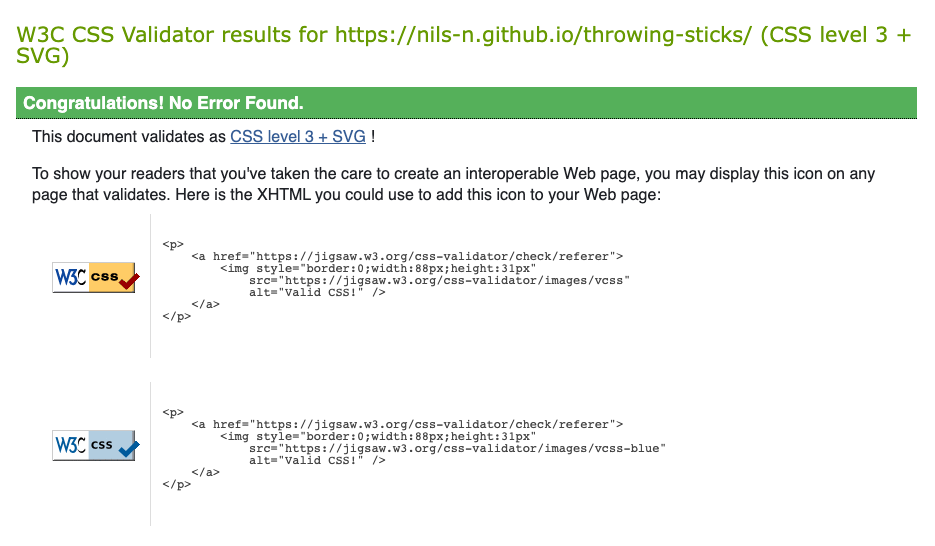
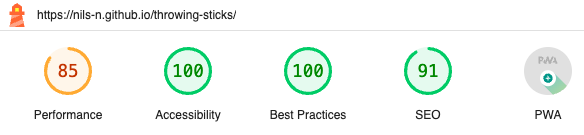
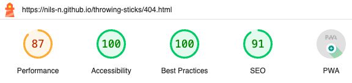

# TESTING 

The main Testing document can be found here : [Numbers Testing Results](/assets/testing/throwing-sticks-test-results.numbers).

-----

## Table of Contents 

- [Tests for Functionality ](#tests-of-functionality)
    - [Results W3C HTML Validation](#results-w3c-html-validation)
    - [Results W3C CSS (Jigsaw) Validation ](#results-w3c-css-validation)
    - [Results Jshint Javascript Validation ](#results-jshint-javascript-validation)
    - [ Results Unit Tests With Jest](#results-unit-tests-with-jest)
- [Tests for Accessibility](#tests-of-accessibility)
    - [Results WebAIM Accesibility Test](#results-webaim-accesibility-test)
    - [Results A11y Color Test](#results-a11y-color-test)
    - [Results Google Lighthouse ](#results-chrome-lighthouse)
- [Tests of User Stories ](#tests-of-user-stories)
- [Tests for Compatibility ](#tests-for-compatibility)
- [ Issues Found During Testing ](#issues-found-during-testing)

---

## Tests of Functionality 

First, the website has been tested that it works functionally correct. All testes have passed.

### Results W3C HTML Validation

In the table below the outputs of the W3C HTML Validation results. All tests passed. 

| Page     | Output       | Result |
| -------- |:------------:| ------:|
| Main     |   | Pass   |
| 404   |    | Pass   |

### Results W3C CSS Validation

In the table below the outputs of the W3C CSS Jigsaw Validation results. All tests passed. 

| Page     | Output       | Result |
| -------- |:------------:| ------:|
| Main     |   | Pass   |
| 404   |    | Pass   |

### Results Jshint Javascript Validation 

In the table below the outputs of the JSHint Validation results. No significant errors occured. 

| File           | Result | Justificaction of insignificant errors  |
| -------------- | :----: | ----: |
| display.js     |  Pass  |  1 error : Class properties must be methods. I call this insignificant regarding the scope of the project. |
| external-d3.js |  Pass  |   4 errors  :  Missing "use strict" statement. I call that this is not a significant error in the context of this project as this was not covered by the course material up until now.  |
| main.js        |  Pass  |   7 errors  : Missing "use strict" statement. insignificant regarding the project scope.  |
| simulation.js  |  Pass  |  1 Warning : Class properties must be methods. I call this insignificant regarding the scope of the project. |
| stick.js  |  Pass  |  Warning :  Class properties must be methods. Also tested with ESlint and this linter does not complain. |
| display.test.js       |  Pass  | 1 error  : Missing "use strict" statement. insignificant regarding the project scope.   |
| simulation.test.js       |  Pass  |  1 error left ‘document.write can be a form of eval.’ From the line document.write( fileContents). This line was copy + paste from the Code Institute Course Material, so i must assume that this is not a significant error.  |
| stick.test.js       |  Pass  |  1 error left Missing "use strict" statement |

 
### Results Unit Tests With Jest

In the screenshot below the outputs of the Jest Unit Test results. No errors occured. Code Coverage of the tests are not 100% but that is justified for this project since 
- Large parts of the front-ent are not included in the unit tests due to the use `d3.js` outside of a dedicated Front-end frameworks such as `vue` or `react` (as reasoned above) 
- The tests istself were not the strictest - being mindful about the time to complete this project I decided to have some of the functionality tested manually
- it is not within the assessment criteria of the project

| Page     | Output       | Result |
| -------- |:------------:| ------:|
| Results     |   | Pass   |
| Coverage   |    | Pass   |

-----

## Tests of Accessibility 

### Results A11y Color Test

In the table below the outputs of the A11y Color Contrast Validation results of the main color contrasts of the website. All tests passed.

| Page     |                                                  Output                                                  | Result |
| -------- | :------------------------------------------------------------------------------------------------------: | -----: |
| Main     |      |   Pass |
| 404      |      |   Pass |

### Results WebAIM Accesibility Test

In the table below the outputs of the WebAIM Accessibility results of the website. All Tests passed.

| Page     |                                                  Main                                                  | 404 Page |
| -------- | :------------------------------------------------------------------------------------------------------: | -----: |
| Output      |      |      |
| Result      |  Pass   |   Pass |

### Results Chrome Lighthouse 

The Chrome Lighthouse Tool integrated in the Chrome Developer Tools has been applied to test the performance and accessibility of each page.

For all pages, it suggest to serve static assets with an efficient cache policys.
Accessibility scores sufficiently high across all pages. 

Performance Score is a little low but for the scope of the project in an acceptable range. 

| Page     | Result       | 
| -------- |:------------:| 
| Main   |   | 
|        |  Performance scores a bit low.  Lighthouse suggests to serve static assets with an efficient cache policys. | 
| 404   |    | 
|        |  Performance scores a bit low. Lighthouse suggests to serve static assets with an efficient cache policys. | 

-----

## Tests of User Stories 

The user stories have been tested case-by-case. All tests passed.

<table style="height:100%">
    <tr>
        <th> Verify User Stories </th>
    </tr>
    <tr>
        <td>   </td>
    </tr>

</table>

-----

## Tests for Compatibility 

The website has been tested for compatibility between browsers, and that the website is responsive and displays correctly on all screen sizes as specified during the design stage. All tests passed. 

-----

## Issues Found During Testing 

This section is to document any bugs found during testing of the website. 

<table style="width:90%">
    <tr>
        <th> Test Case</th>
        <th> Description </th>
        <th> Errors Found  </th>
    </tr>
 <tr>
    <td> TC01  </td>
    <td> Validate that document passes A11y Automated Color Contrast Check  </td>
    <td> 3 errors in the first pass due to missing form labels on all 3 sliders, 4 warning for using ‘underline’ in the text </td>
 </tr>
 <tr>
    <td> TC04  </td>
    <td> Validate that Javascript modules pass Jshint Validator  </td>
    <td> 5 errors were found, most of them related to stick.js: line 5, col 1, 'class' is available in ES6 (use 'esversion: 6') or Mozilla JS extensions (use moz) </td>
</tr>

 <tr>
   <td></td>
    <td></td>
    <td> 8 errors were found. Mainly missing semicolons and warning that [‘red’] and [‘green’] notation should be updated with ‘. </td>
</tr>

 <tr>
     <td></td>
    <td></td>
    <td> 49 errors in the first run, mostly semicolons etc. ,  Missing "use strict" statement </td>
</tr>

 <tr>
   <td></td>
    <td></td>
    <td> 
63 errors in the first run, mainly semicolons,  2 errors are related to Missing "use strict" statement., 1 error was ‘document.write can be a form of eval.’ From the line document.write( fileContents).</td>
</tr>

 <tr>
    <td> TC09  </td>
    <td> Validate that website passes WAVE WebAIM  Accessibility Check with no Errors  </td>
    <td> 3 errors with a missing ‘form’ label of all the sliders,  and 4 alerts regarding underlined text. </td>
</tr>

 <tr>
    <td> TC10  </td>
    <td> Validate website with Google Chrome Lighthouse Tools</td>
    <td> 
performance was at 79 % for performance due to javascript files being loaded inside the header  </td>
</tr>

 <tr>
    <td> TC111  </td>
    <td> Validate that website is responsive and displays correctly on different screen sizes (Chrome)
 </td>
    <td> 
The x-axis of the scatter plot of the third diagram would stay of the size for that I had in the client window of 320px, while the surrounding div would enlarge </td>
</tr>

 <tr>
    <td> TC12  </td>
    <td> Validate that website is responsive and displays correctly on different screen sizes (Firefox)
 </td>
    <td> 
 slider of the first diagram overflows </td>
</tr>

 <tr>
    <td>   </td>
    <td> 
 </td>
    <td> 
 the first diagram did not resize correctly and stayed in the size for the display with 320px
</td>
</tr>

</table>

--- 

